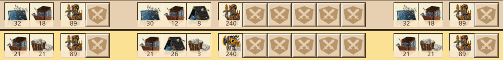
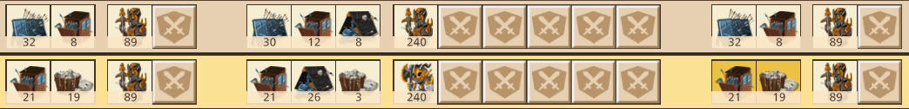

The Art of the Attack: All Together
===================================

And like always, read the previous section if you haven't already. Provides important information :it:`yadda yadda yadda`. We did all the homework. Now let's have fun. :3

    You know who you are (˵ •̀ ᴗ - ˵ ) ✧

:blue:`The Shield Wave and the Alt Wave -- Revisted`
~~~~~~~~~~~~~~~~~~~~~~~~~~~~~~~~~~~~~~~~~~~~~~~~~~~~

Now that we've explained tools and troops, let's let them live in harmony:

    50-tool setup

    40-tool setup

On a quick note, you should always use ranged troops on the shield waves, even on the front. Because you are reducing the ranged power to :number:`0`, you want type advantage against the remaining melee defenders.

:blue:`The Issue with the Shield Wave`
~~~~~~~~~~~~~~~~~~~~~~~~~~~~~~~~~~~~~~

Shield waves are dumb. No really. They kill significantly less defenders than their alt wave counterparts. Their only purpose is to deter the other player from posting :number:`100r/0`, all slits. Remember, slits give :number:`+70%` ranged bonus, while bombs gives :number:`+43%` melee bonus, so if given the chance, all ranged is more powerful than all melee.

That's why you don't give the defender a chance. There are two schools of thought regarding shield waves. Either clump them towards the beginning of the attack or clump them at the end. Let's take a look at each.

:underline:`Shield Waves: Back`
^^^^^^^^^^^^^^^^^^^^^^^^^^^^^^^

On a 6 wave attack: alt, alt, alt, :blue:`shield`, alt, :blue:`shield` |br|
On an 11 wave attack: alt, alt, alt, alt, , alt, :blue:`shield`, alt, alt, :blue:`shield`, alt, :blue:`shield`

If the attacker sends his shield waves towards the beginning like the majority of people do, the defender is safe to leave their default defense setup, whether they realize it or not. That is, :number:`80m/20`, :number:`3` bomb / :number:`1` slit.

The rationale is a bit tricky, but think of it like this. You are sending all ranged on the flank (see `previous section <troops.html>`_). The tendency is to want to defend with as much ranged as possible, without leaving yourself succeptible to `shield spamming <defense.html#ranged-majority>`_ and `wall wiping <defense.html#r-0-a-lesson-in-wall-wiping>`_. The attacker's shields counter defending ranged troops. But the defending ranged troops counter your attacking ranged troops. If the defender knows or anticipates that you sent the shields in the backend, then their defending ranged troops won't be bothered until then. Therefore they will use more ranged defenders, and defend with :number:`2` slit, instead of the default :number:`1`, to help further boost their effectivess against your ranged attackers.

.. tip::
    If you anticipate the attacker sends his shields in the back, post :number:`60m/40`, :number:`2` bomb / :number:`2` slit.

:underline:`Shield Waves: Front`
^^^^^^^^^^^^^^^^^^^^^^^^^^^^^^^^

On a 6 wave attack: :blue:`shield`, alt, :blue:`shield`, alt, alt, alt |br|
On an 11 wave attack: :blue:`shield`, alt, alt, :blue:`shield`, alt, :blue:`shield`, alt, alt, alt, alt, alt, ...

So why would you send the shield waves in the front? Normally, you shouldn't. It's typically safer to send them in the back, BUT if the defender is lured into :number:`60m/40`, the increased number of defending ranged troops and the extra slit will be punished by the early shield waves. The shield waves will make quick work of the ranged defenders, and leave less ranged defenders to deal with your ranged attackers in the backend of your attack.

.. tip::
    If you anticipate the attacker sends his shields in the front, post :number:`80m/20`, :number:`3` bomb / :number:`1` slit.

:underline:`Concensus`
^^^^^^^^^^^^^^^^^^^^^^

This goes back to why I said shield waves were dumb. Really, you want to put them in the front, to get them "over with" and let the defender know he can't just spam ranged defenders and win. They are dummy waves. They don't kill many defenders and they're a waste of space. At least if you put them in the front, you prevent the defender from going :number:`60m/40`, :number:`2b/2s`. But, most people don't adjust from :number:`80m/20`, :number:`3b/1s`, because either they don't know why they should or because the're too lazy to adjust it... or maybe both. That is why the safer option is to put them in the back - to take advantage of the vast majority of defenders who don't touch their m/r ratio or tools.

From a defender's perspective, :number:`60m/40`, :number:`2b/2s` against shields in the back is stronger than :number:`80m/20`, :number:`3b/1s` against shields in the front. The upper hand is relegated to the defender if he correctly reads the shield placement (it essentially boils down to guesswork, as you can't typically see the tool placement of each wave from the incoming attack), doubly so, if he can safely defend :number:`60m/40`, :number:`2b/2s`.

As more people learn to adjust their attack by placing their shields in the back, the more viable the correlating defense adjustment is. The more people take the "safe" route of shields in the back, the more prevalent :number:`60m/40`, :number:`2b/2s` will become. If the meta shifts towards :number:`60m/40`, :number:`2b/2s`, people will start abusing shields in the front again. Rinse and repeat.

:blue:`The m/r Ratio -- Revisited`
~~~~~~~~~~~~~~~~~~~~~~~~~~~~~~~~~~

I briefly mentioned needing to even your m/r ratio in the courtyard battle. Typically the defender will only elect to protect one flank, in order to consolidate their power, and guarantee there is no courtyard bonus for either side. Try to ancipate losing all the troops on one flank, and calculating how many of each troops you need in the courtyard assault to make sure the ratio going into the courtyard battle is as even as possible. If you fill your courtyard assault all with one troop, and your ratio still isn't even, you can sneak the rest of the needed troops on the front alt waves, even if that means mixing types together on a wave.

If you are hitting someone who you anticipate is offline, and they have a lopsided m/r ratio, then mismatch their ratio. It's important that they're offline. For example, say the defender left his khan defense up and has :number:`75r/25` in his courtyard. You send a :number:`75m/25`, but if he's online, the defender can easily adjust their courtyard ratio to :number:`75m/25` and massacre your troops with the lopsided ratio advantage.

:blue:`Conclusion`
~~~~~~~~~~~~~~~~~~

You are now well equipped with the fundamentals of PvP. There are still many things I have not addressed, namely sovereign tools. They will have their own dedicated guide, as they operate almost on their own plane. But for now, I hope my guide helped. Feel free to reach out to me on discord @ :green:`commcl` with any questions or feedback.

Happy Hunting~ |br|
comm
