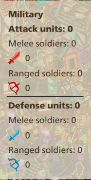
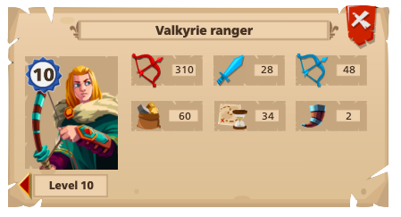
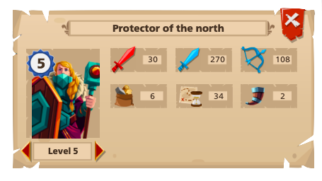

Introduction
============

This will be about a 15 minute read for those curious, but trust me, it'll be worth every minute of your time. You can skips sections if you wish, but if you're new, I highly encourage reading through the entire thing. If you already know the basics, try starting `here <tools-waves.html>`_.

:blue:`Type Matchups`
~~~~~~~~~~~~~~~~~~~~~

The foundation of pvp lies upon type matchups. There are two troop types, melee and ranged, which are then further split up into attackers and defenders. Like this: 
|br| |type-overview|

Type matchups are deceivingly simple. Ranged attackers are effective against melee defenders and melee attackers  are effective against ranged defenders. The converse also holds true. Range attackers are weak against ranged defenders and melee attackers are weak against melee defenders.

If you're the :red:`attacker`, you want to :red:`MISMATCH` the defender's ratio. If he defends :number:`75%` range and :number:`25%` melee, you want to send :number:`75%` melee and :number:`25%` range.

If you're the :blue:`defender`, you want to :blue:`MATCH` the attacker's ratio. If he sends :number:`75%` range and :number:`25%` melee, you want to defend :number:`75%` range and :number:`25%` melee.

Simple enough.

:blue:`Reading Stat Lines`
~~~~~~~~~~~~~~~~~~~~~~~~~~

Let's take a closer look at a unit's stat line. Here's a Protector of the North:
|br| |protector-of-the-north|

The red sword signifies a melee type unit. The number beside it (:number:`30`) denotes its attacking strength. The defensive stat is broken up into two components. It's defending strength against melee troops (:number:`270`) and it's defending strength against ranged troops (:number:`108`). Based off its stats, it's not hard to determine this is a defense troop.

|br| |valkyrie-ranger|

The red bow means a ranged type soldier. High attack stat (:number:`310`), low defense stat. The valkyrie ranger is an offensive troop. Consistent with `Type Matchups`_, it's ranged defense stat (:number:`48`) is higher then its melee counterpart (:number:`28`), even though both are very low.

:blue:`Basic Calculations`
~~~~~~~~~~~~~~~~~~~~~~~~~~

It should go without saying that you attack with offensive troops and defend with defensive troops.

So let's say you pit them against each other. The defending strength of the protector is :number:`108` as it is being attacked by a ranged unit. The attack stat of the valkyrie ranger is :number:`310`. Therefore, it would take around 3 protectors to successfully fend off 1 valkyrie. This makes sense as again, ranged attackers are innately effective against melee defenders.

Next up: Wall Basics