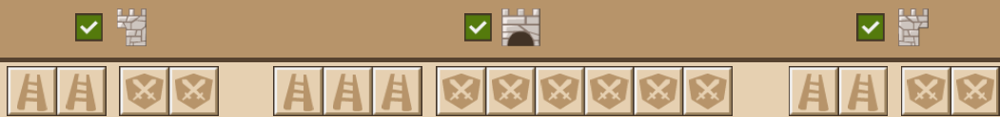
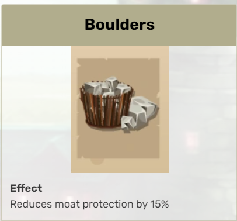
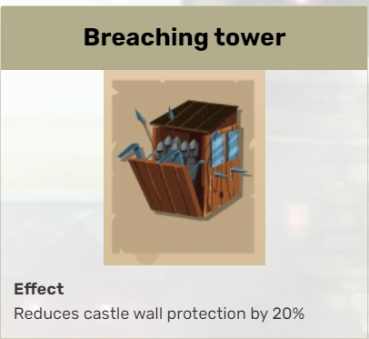
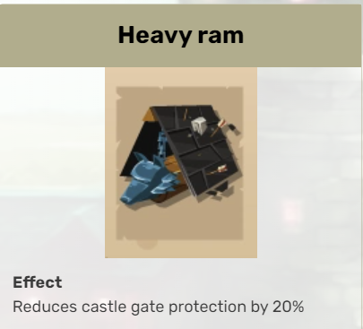
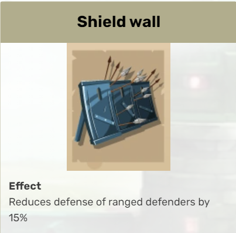

The Art of the Attack: Tool Basics
==================================

If you haven't already, take a look at the `previous section <wall-basics.html>`_. It provides a vital foundation to what we will extensively dissect here.

Let's take a look at the most common mistakes people make when attacking: tools! I encourage you to read through each section, as core concepts will be explained indiscrimnately throughout. For now we'll ignore the existence of sovereign tools, so we can better establish the fundamentals without introducing too many variables.

:blue:`Tools?`
~~~~~~~~~~~~~~

Tools can be easy to overlook if you don't understand their importance. They are one of the most misunderstood aspects of PvP from a both offensive and defensive standpoint.

Attacking tools are responsible for reducing the defenders power and are targeted towards four specific defense bonuses: moat, ranged, wall, and gate. The more astute among you will point out that the melee defense bonus is missing. This is intentional game design and heavily influences the attacking meta.

Here's an overivew of a sample attack wave:
|br| |wave-overview|

There are two tool slots on each flank and a third tool slot on the front as denoted by the ladder sprites. (The other slots are, understandably, for troops.) For reasons that will be discussed later, the third tool slot on the front is always reserved for a gate tool.

:underline:`Types`
^^^^^^^^^^^^^^^^^^

That leaves two tool slots to reduce three kinds of defense: the wall, the moat, and the ranged defense (as again, there is no tool that reduces melee defense). Let's take a look at the best in slot tool for each type:
|br| |boulders| |shield-wall| |breaching-tower| |heavy-ram|

There are many tools in the game, but these are the best of each of their respective types (with exception to sovereign tools).

:blue:`Tool Fundamentals`
~~~~~~~~~~~~~~~~~~~~~~~~~

.. |flank-bonuses| image:: ./images/flank-bonuses.png
    :scale: 50 %

.. danger::
    If you read no other section in this guide, then I implore you to read this one.

If you understand the fundamentals of tools, then everything about PvP will fall in place. If you don't, either: :olive:`(1)` You will try to send your own attacks and they will suck or :olive:`(2)` You will copy-paste other people's formations and you will still suck, because there is no singular perfect attack formation. Either way, you will ultimately fail to learn how to proactively send and defend attacks. This is a massive issue in the game, as copy-paste formations is rampant in this game. For those who understand tools, the issue stops. Entire top alliances are built on complete ignorance of PvP fundamentals. And it shows when they go to war.

Now that I've thoroughly convinced and humbled you (If you're MISC, I've probably already lost you :P), let's lay some ground rules. There are a couple axioms in PvP that are generally accepted in the upper echelons of PvP play, but are hard to prove definitively without access to GGE's source code. The first and most important axiom is that all defense bonuses are treated equal. This isn't strictly true, but the difference is negligible enough where thousands of attacks from top PvP'ers haven't refuted its fundamental nature. :olive:`50%` range > :olive:`40%` wall. :olive:`90%` moat > :olive:`80%` melee. And so on and so forth. If the number is larger, it can be assumed as more impactful.

.. important::
    Axiom 1. All tool bonuses are treated equally.

Let's take a look at the typical flank of a defender.
|br| |flank-bonuses|

We have two tool slots to work with, but there are four defensive bonuses! Remember we can disregard the melee defensive bonus (:olive:`440%`) as we don't have a tool to reduce it. We're down to three. But we still only have two tool slots. Welcome to your journey towards PvP mastery.

:underline:`Three defensive bonuses. Two Tool Slots! Help!!`
^^^^^^^^^^^^^^^^^^^^^^^^^^^^^^^^^^^^^^^^^^^^^^^^^^^^^^^^^^^^

Remember how I said that each defensive bonus is treated equally? Well the logical proof would state that you would simply reduce the two highest bonuses, and disregard the lowest. If you thought that, pat yourself on the back. You're the smartest guy in the room. Then take your hand, and slap yourself, because you're also the dumbest guy in the room. 

.. important::
    Axiom 2. Melee defenders are inherently more valuable then ranged defenders.

This makes sense, as you have tools to reduce the defender's ranged bonus, but not their melee bonus. From the `introduction <wall-basics.html>`_, we learn that attacking melee troops are effective against defending ranged troops and that attacking ranged troops are effective against defending melee troops. So if melee defenders are more valuable then ranged defenders, we just send all ranged troops for the "type advantage" and live happily ever after? Actually this is more true than than you would think, but still not entirely accurate.

... But what does this have anything to do with our tool slot problem? 

Read on, young grasshopper. :3
