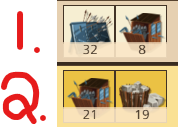
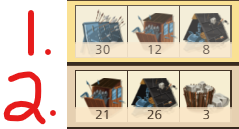

The Art of the Attack: Wave Types
=================================

We have have two primary tool waves for the flanks:
|br| |flank-formations|

The first one is dutifully named the "Shield Wave" and, well, the other one doesn't really get a name. Something like "Non-Shield Wave" or even "Moat Wave" would make sense. Who knows why it doesn't get a name, I don't make the rules. ¯\\_(ツ)_/¯

I like calling them "Alt Waves" as in "alternate wave not containing shields". It's simple and most importantly, short lol.

I know what's following is a lot to read. Take a breather. You're doing great. Let's dive in.

:blue:`The Shield Wave`
~~~~~~~~~~~~~~~~~~~~~~~

Let's take a look at the 1st line.
|br| |flank-formations|

:olive:`32` shields + :olive:`8` towers. This is the standard setup for :olive:`40`-tool large flanks. Higher level players with the :olive:`+10` tool wave limit will usually see this as :olive:`32` shields and :olive:`18` towers.

What's special about the number :olive:`32`? Well the easiest answer, is that we wouldn't have enough room to add more tools, but that sidesteps the question too easily.

The definitive answer is that there is no answer. Books closed. Period over.

Bear with me. The item effectiveness of the shield wall is :olive:`-15%` ranged defender bonus. :olive:`32 x -15% = -480%`. Let's think about this from a defensive standpoint. Remember that the base power of ranged (and melee) on defense is :olive:`100%`. The most ranged bonus from defensive tools you'll eversee is :olive:`2` slits, which gives us :olive:`70% x 2 = 140%` ranged power That gives us :olive:`+240%` total. Casts usually hover around :olive:`230%` bonus (:olive:`300%` is absolute max, but at that point, you should rethink hitting the person) which gives us... :olive:`470%`. Aha! 

The popular shield wall amount if you're familiar with copy-paste formations is :olive:`37`. That's :olive:`-555%`. :olive:`100%` (base) + :olive:`210%` (:olive:`3` slits) + :olive:`230%` (castellan) = :olive:`540%`. It's a little higher if you account for dHOL bonuses (you don't need to know what that is, just know it exists), but the math checks. The problem with the :olive:`37` shield argument, is that it either assumes :olive:`(1)` a :olive:`300%` castellan or :olive:`(2)` a :olive:`3` slit setup. Both arguments are absurd.

An even more extreme argument purports :olive:`42` shields, which accounts for both option :olive:`(1)` and :olive:`(2)`. This is more than absurd. We'll pick this idea up later, but for now, disregard it.

:blue:`The Alt Wave`
~~~~~~~~~~~~~~~~~~~~

Let's borrow the image from earlier again.
|br| |flank-formations|

:olive:`21` towers + :olive:`19` boulders. This is the standard setup for :olive:`40`-tool large flanks. Higher level players with the :olive:`+10` tool wave limit will usually see this as :olive:`21` towers and :olive:`21` boulders.

Back to magic numbers. What is the significance of :olive:`21`? A :pink:`level 8` castle wall gives :olive:`+200%` defense. The max castellan wall bonus (excluding hero) is :olive:`+220%`. What about tools? No one uses wall tools on defense. No one. This will be explained later. :olive:`200% + 220%  = 420%` bonus. Each breaching tower grants :olive:`-20%` wall bonus. And wouldn't you know it, :olive:`21 * -20% = -420%`.

Why :olive:`21` boulders? a :pink:`level 4` ruby moat gives :olive:`+85%` moat. The max castellan moat bonus (excluding hero) is :olive:`+120%`. The moat tool has it's own slot in the defense, so it will always be present. The strongest moat tool is the inferno moat which gives :olive:`+110%`. :olive:`85% + 120% + 110% = 315%`. Each boulder grants :olive:`-15%` moat bonus. And look at that, :olive:`21 * -15% = -315%`. Math is magical.

You can probably understand that a :olive:`40`-tool wave can't hold both :olive:`21` towers and :olive:`21` boulders. So why do we favor :olive:`21` towers over :olive:`21` boulders? Remember that the tower tool grants :olive:`-20%` wall bonus, but the moat tool only gives :olive:`-15%` moat bonus. This means that the wall has more value then the moat per tool. :olive:`21` towers and :olive:`19` boulders sacrifices :olive:`30%` moat, but :olive:`19` towers and :olive:`21` boulders sacrifices :olive:`40%` wall. Remember axiom 1? :olive:`40%` wall > :olive:`30%` moat. (:

:blue:`Front Formations`
~~~~~~~~~~~~~~~~~~~~~~~~

Beautiful you made it to the other side. I won't bore you wtih more math. The methodology behind the tool amounts was important, but this is a guide, not a poorly written manpage. (Well actually...)
|br| |front-formations|

I fibbed. Here's a little for those who are curious: :olive:`200%` (:pink:`level 8` gate) + :olive:`150%` (:olive:`2` porticuluses) + :olive:`160%` (castellan, no hero) = :olive:`510%`.

And yes I'll finally explain why I'm not including the hero bonus in all of these. The castellan hero has 4 traits. Two of them will always be ranged and melee bonus (not guaranteed on the equipment, but players will always chose them). Ranged and melee bonuses persist from the wall to the courtyard battle. The wall, gate, and moat bonuses only apply to the wall attack, meaning their stats are half as valuable in full context. The other two bonuses are usually fought over by the early detection, the courtyard, and the overall strength substats. You don't need to understand what any of that means. But for those who are asking, you have your answer.

All stats thus far are assuming max stats, but rarely will any of them actually be just by nature of the substat priority on equipment. You rarely need every single wall tool and gate especially in the front wave. The moat tools are being choked out, due to the 50-tool limit on the front. You already know how to read defenses, so you can match your towers and gate to the enemy's defense, and you can fit more moat tools in.

:blue:`Putting it Altogether?`
~~~~~~~~~~~~~~~~~~~~~~~~~~~~~~

Not yet. We need to take a look at defense again before we can put the waves together. Cya there. (⁀ᗢ⁀)
