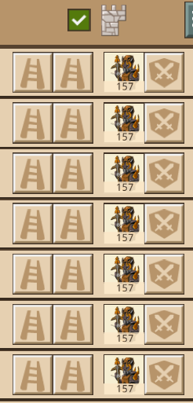
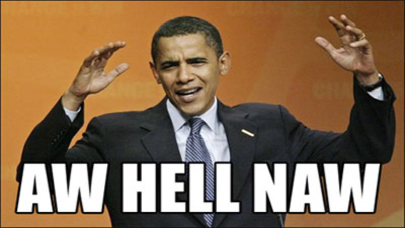
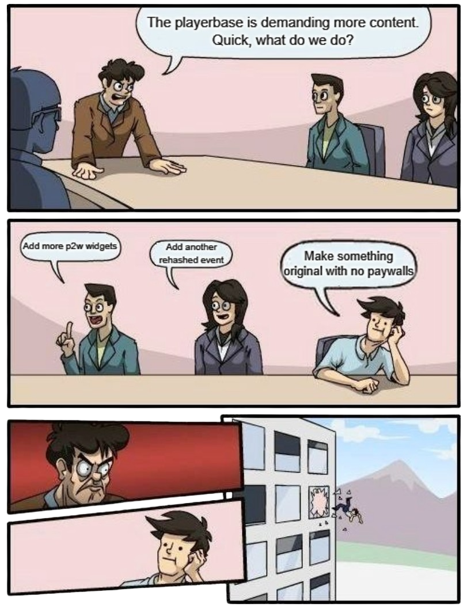

The Art of the Attack: Troops!
==============================

One final pit stop before we put everything together.

:blue:`Flanks: Ranged Only!`
~~~~~~~~~~~~~~~~~~~~~~~~~~~~

We always put ranged troops down the left and right flanks. Always. Unless you're trolling. In the `last section <defense.html>`_, we explored the most optimal wall ratio the defender can use: :number:`80m/20`. If you send melee troops, you are giving free type advantage to the defender. What if the defender is using `majority ranged <defense.html#3. Ranged Majority>`_? Then you reduce the ranged power to :olive:`0` with shields, and you gain free type advantage on the remaining melee defenders. And if they use all ranged? Ya' wall wipe 'em. Give the last section a read if you're a little bit lost. No sense skipping around. :3

    Johnny reads my guides. Johnny is sending all ranged on his flanks. Be like Johnny.

:blue:`Front: Evening the Ratio`
~~~~~~~~~~~~~~~~~~~~~~~~~~~~~~~~

If there were as many troops in the courtyard assault as the attack itself, you would use all ranged down the centre too. Unfortunately, there is not, so the attacker must prioritize sending an even ratio of melee and ranged troops. Why? Well think about it. If :number:`70%` of the attacking troops that make it into the courtyard are ranged, then the defender can set the courtyard ratio to also be :number:`70%` ranged. This goes all the way to the `beginning section <introduction.html#Type Matchups>`_, where I explained that as the defender, you want to match the ratio the attacker sends. Fundamentals go a long way.

.. tip::
    If you send :number:`50m/50` to the courtyard, the defender is forced to defend :number:`50r/50`, which of course, cancels out a ratio advantage.

But sending melee troops down the centre makes it weaker, right? I mean I literally just spent the entire last section explaining why it was a bad idea.

:blue:`A Lesson in Brute Forcing`
~~~~~~~~~~~~~~~~~~~~~~~~~~~~~~~~~

..

    :it:`"Luke, use the force... brute force!"` - Obi Wan Kenobi, probably

:underline:`Case Study: F2P`
^^^^^^^^^^^^^^^^^^^^^^^^^^^^

Let's imagine you're f2p and you're attacking another f2p. Assuming you're level :number:`70`, you'll typically have :number:`4` base waves to attack with and up to :number:`2` waves from your hall of legends. The defender doesn't have access to any op wall widgets, as they are well, f2p. They will most likely have around :number:`~1000` on the wall. As an attacker, you can send :number:`240` down the front. That's :number:`240 * 6 = 1440`.

Let's take it a step further. If you're in a good alliance, you'll have access to the :number:`+70%` front unit limit widget. (You don't need to understand what a widget is at this point; just know that it exists.) That's :number:`517` down the front for :number:`408 * 6 = 2448`.

I'm sure this is how the :number:`1000` troops defending feel when their castle owner sets them to all front:
|br| |ah-hell-nah|

:underline:`Case Study: P2W`
^^^^^^^^^^^^^^^^^^^^^^^^^^^^

And for the other end of the spectrum. You've spent a little of your dad's retirement saving, or maybe all of it. You have :number:`4` base waves + :number:`7` wave look item + :number:`1` wave from the commander + :number:`2` from your Hall of Legends and maybe even :number:`1` wave from your general . That's :number:`15` waves. You'll have access to the :number:`+80%` front unit limit widget, as well as :number:`+60%` from the BTH widget (again, disregard its meaning for the sake of the argument), :number:`+78%` from your general Toril or Sasaki and :number:`+120%` from the commander. :number:`304 * [100% (base) + 80% + 60% + 78% + 120%] = 1332` extra troops on a wave for a total of :number:`1332 * 15 (waves) = 19980`.

I'll keep the defense calculation short and sweet: :number:`2300` (:number:`23` lv :number:`8` towers) + :number:`325` (orange flour mill wall widget) + :number:`200` (purple barracks wall widget**) = :number:`2825` * [:number:`100%`` (base) + :number:`57%`` (horatio) + :number:`40%`` (sovereign tool) + :number:`120%`` (castellan bonus) + :number:`30%`` (egg widget)] = :number:`9802`.

:small:`** The baracks wall widget is only purple, because currently the orange one is bugged. It's supposed to give` :small-num:`350` :small:`wall unit capacity, but mysteriously, it gets converted to` :small-num:`+800` :small:`courtyard defense, which is a complete joke when your courtyard can hold hundreds of thousands of troops.`

|board-meeting-meme|

:underline:`Conclusion`
^^^^^^^^^^^^^^^^^^^^^^^

Defending the front flank is a logistical nightmare almost unilaterally throughout the game. By sheer numbers, it hardly ends up mattering that you are sending melee down the front and effectively weakening its effectiveness. It might be close as the defender, but if you're holding mid, you need to dedicate all your troops there to even have a shot. If you lose the front, because the other two flanks are undefended, the attacker gains :number:`30%` courtyard battle bonus. Needless to say, the the courtyard defenders will be slaughtered.

.. important::
    An attack will simply brute force its way through the centre flank. It is rarely ever worth defending.

Now we get to put everything together ⸜(｡˃ ᵕ ˂ )⸝