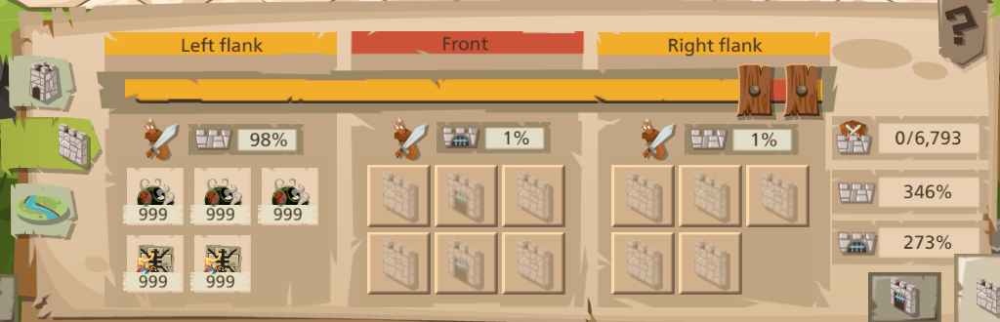
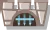
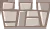
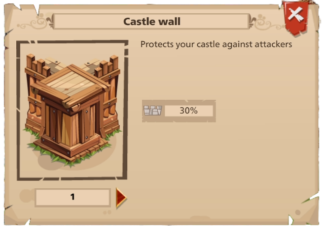
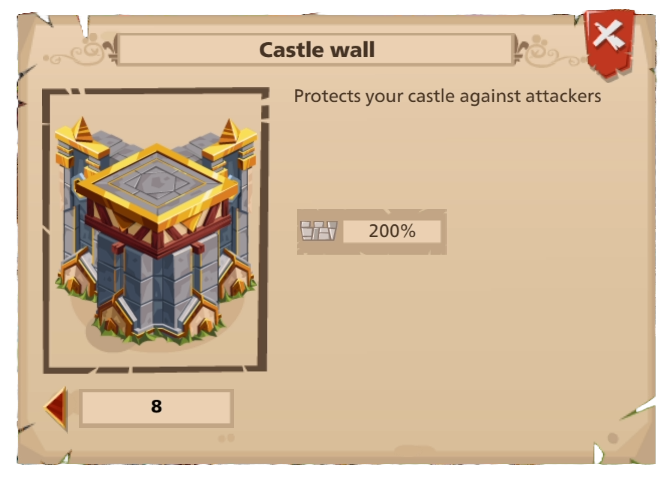
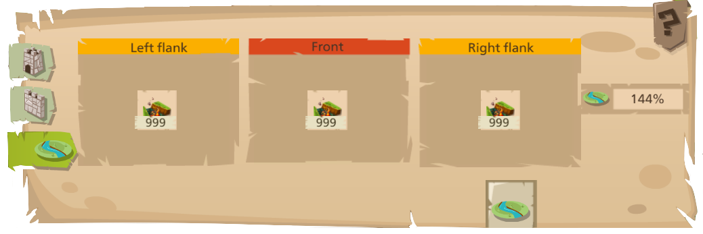
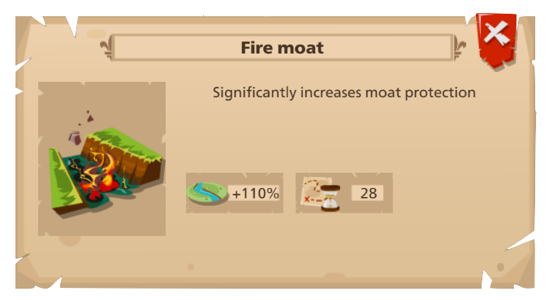
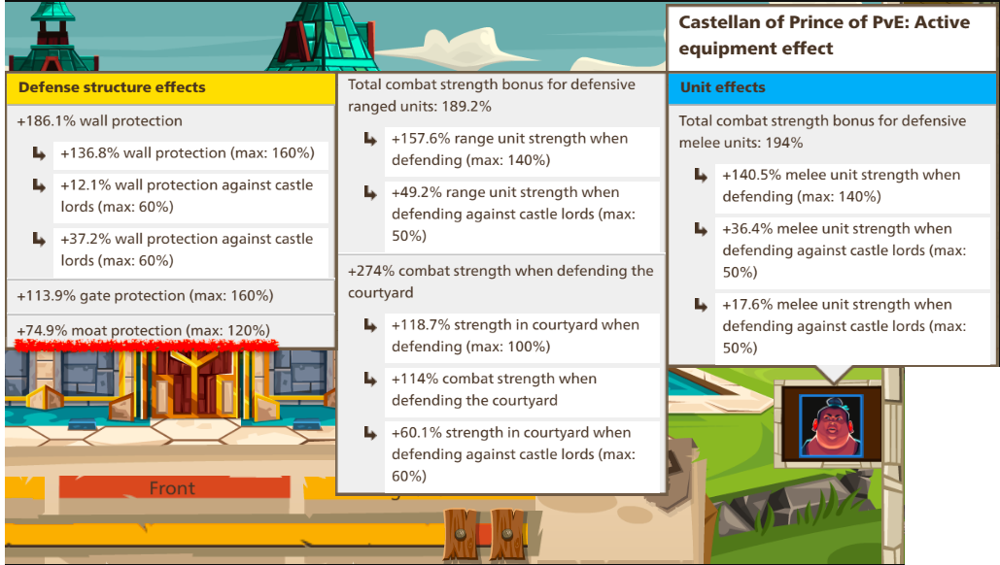

Wall Basics
===========

The wall is divided into three sections: The left flank, the front, and the right flank. Each flank (including the front) can carry tools which greatly influence the bonuses received on the wall. 

|castle-wall|

:blue:`Overview`
~~~~~~~~~~~~~~~~

There are four strength bonuses on each flank: moat |moat|, ranged |ranged-def|, melee |melee-def|, and wall |wall|. There's also an additional gate bonus |gate| for the front.

You can increse your wall protection by upgrading the wall in your castle. For example compare a level 1 (:olive:`30%` bonus) and a level 8 wall (:olive:`200%` bonus):

|lv1-wall| |lv8-wall|

Likewise, you can increse your gate bonus by upgrading the gate and the moat bonus by upgrading the moat. Simple enough.

:blue:`Calculating Bonsues`
~~~~~~~~~~~~~~~~~~~~~~~~~~~

The overview of a flank will display if you hover or click on its corresponding wall section.
|br| |flank-bonuses|

The symbols should be familiar. From left to right: moat bonus, ranged bonus, melee bonus, and wall bonus. Note, the centre flank will also have a gate bonus.

:underline:`How are the numbers derived?`
^^^^^^^^^^^^^^^^^^^^^^^^^^^^^^^^^^^^^^^^^

Let's start with the moat bonus, :olive:`254%`.

This castle has a :pink:`level 3` moat (the ruby one for those wondering), which gives :olive:`+70%` bonus. Remember the tool slots I mentioned earlier. Navigate to the moat tab in your castle defense menu. (If you haven't unlocked the moat yet, then the moat bonus is :olive:`0%`.)
|br| |moat-tab|

I briefly touched on tool bonuses earlier. Well, each flank can slot one type of moat tool (again, assuming it's actually unlocked). You can stack the tool to :olive:`999`. Unfortunately, it's not a multiplative bonus. Rather, the tool's bonus will be active for :olive:`999` waves of attacks. In other words, every wave of attack against your castle wall consume one tool from each slot.

.. tip::
    It's generally a good idea to keep your tools at 999 if possible, so it isn't rendered empty after several attacks.

The tool slotted for the moat here is called an inferno moat. Another :olive:`+110%` accounted for.
|br| |inferno-moat|

:underline:`The castellan bonus`
^^^^^^^^^^^^^^^^^^^^^^^^^^^^^^^^

So where's the rest? The last bonus comes from the castle's castellan. The castellan is composed of equipment parts that combine together for powerful bonuses. Let's take a look at this one through the castle defense menu where we have been exploring (If you have no idea where I am, click your castle gate, then click on Defense from the selection wheel).
|br| |castellan-moat-bonus|

There's the remaining :olive:`74%`. (:

:underline:`The other bonuses`
^^^^^^^^^^^^^^^^^^^^^^^^^^^^^^

Let's revisit this image from earlier:
|br| |castle-wall|

Unlike the moat (and the gate), which have their own dedicated tool slots, the ranged, melee, and wall bonuses all fight for tool slots. You'll start with one tool slot for each flank, then gain a slot at wall :pink:`level 2`, :pink:`level 3, and 5` for :olive:`4` total slots. The 5th slot can be specially opened for players who prefer defense over offense, but typically you'll see :olive:`4` slots out in the wild.

The wall and gate bonuses, like their moat counterpart, both have innate bonuses from their corresponding building structures. Likewise, any corresponding tools will boost their stats.

Melee and ranged bonuses have no corresponding building structures. Instead, their defense will always start with 100% base power plus tool and castellan bonuses.

.. important::
    Wall tools are rarely used on defense. Instead the tool slots are typically split between ranged and melee bonuses.

The next section will address the reasoning behind this. Now that we have most of the basics down, it's time to dive into actual combat strategies.
